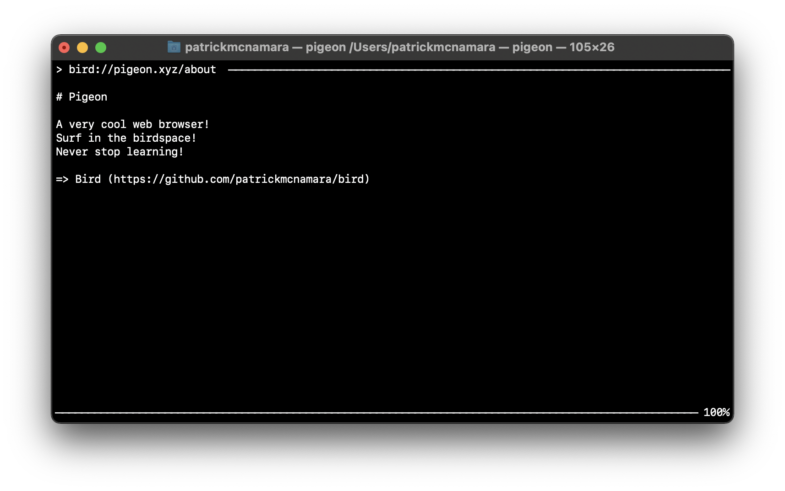

# Pigeon

Pigeon is a browser for the [birdspace](https://github.com/patrickmcnamara/bird).
It is a TUI browser.
It works on Linux and macOS.

## Usage

After launching, press `Tab` to enter a URL.
Press enter to go to that page.
It's pretty simple.

## License

This project is licensed under the GNU General Public License v3.0.
